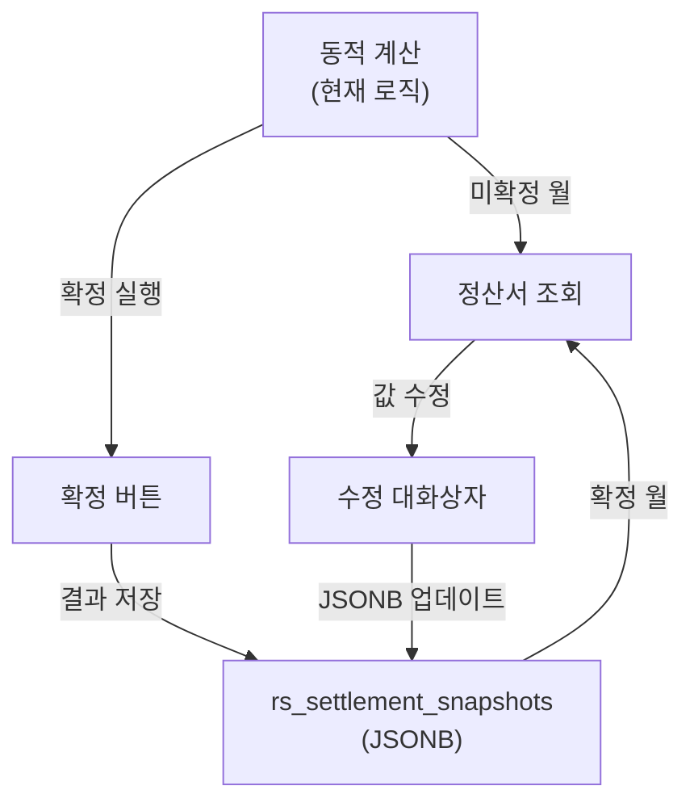

# 정산 확정/수정 시스템 계획

> 작성일: 2026-03-12
> 상태: 대기 (동적 계산 로직 안정화 후 구현 예정)

## 아키텍처 개요



## 핵심 흐름

1. **동적 계산 완성** → 올바른 계산식으로 정산서 생성
2. **확정** → 동적 계산 결과를 DB에 JSONB 스냅샷으로 저장
3. **수정** → 확정 후 개별 값을 대화상자에서 수정 (합계 자동 재계산)
4. **과거 월 처리** → 동적 계산 → 확정 → 실제 지급액과 다른 부분만 수동 수정

## 1. DB 스키마 (새 테이블 2개)

### `rs_settlement_months` - 월별 상태 관리

```sql
CREATE TABLE rs_settlement_months (
  month varchar PRIMARY KEY,
  status varchar NOT NULL DEFAULT 'draft',  -- 'draft' | 'confirmed' | 'paid'
  confirmed_at timestamptz,
  note text,
  created_at timestamptz DEFAULT now(),
  updated_at timestamptz DEFAULT now()
);
```

### `rs_settlement_snapshots` - 파트너별 확정 데이터

```sql
CREATE TABLE rs_settlement_snapshots (
  id uuid DEFAULT gen_random_uuid() PRIMARY KEY,
  month varchar NOT NULL,
  partner_id uuid NOT NULL REFERENCES rs_partners(id),
  data jsonb NOT NULL,
  confirmed_at timestamptz DEFAULT now(),
  updated_at timestamptz DEFAULT now(),
  UNIQUE(month, partner_id)
);
```

- `data` 컬럼에 현재 statement API의 전체 응답을 그대로 저장
- JSONB를 사용하는 이유: 계산 로직이 계속 진화 중이므로, 필드 추가/변경 시 테이블 스키마를 바꿀 필요 없음
- 경로 기반 업데이트(`jsonb_set`)로 개별 값 수정 가능

### 기존 `rs_settlements` 테이블

- 현재 `draft` 상태의 데이터만 존재하며, 새 시스템으로 이관 후에는 참조용으로만 유지 (삭제하지 않음)

## 2. API 변경

### (A) 정산서 조회 API 수정

- 파일: `app/api/accounting/settlement/partners/[id]/statement/route.ts`
- 변경: 요청 시 `rs_settlement_months` 확인 → 해당 월이 'confirmed'이면 `rs_settlement_snapshots.data`를 반환, 아니면 기존 동적 계산 실행
- 확정된 데이터를 볼 때는 `is_confirmed: true` 플래그를 함께 반환

### (B) 확정 API (새로 생성)

- `POST /api/accounting/settlement/confirm`
- 요청: `{ month, partner_ids?: string[] }` (partner_ids 없으면 전체 파트너 일괄)
- 동작:
  1. 대상 파트너들의 동적 계산 실행
  2. 각 결과를 `rs_settlement_snapshots`에 UPSERT
  3. 모든 파트너 확정 완료 시 `rs_settlement_months.status`를 'confirmed'으로 변경
  4. MG잔액(`rs_mg_balances`)에도 동적 계산된 차감액을 기록

### (C) 개별 수정 API (새로 생성)

- `PATCH /api/accounting/settlement/snapshots/[id]`
- 요청: `{ path: "works[0].details[1].revenue_share", value: 123456 }` 형태
- JSONB 경로 기반으로 특정 값만 업데이트
- 수정 시 관련 합계(work_total_*, grand_total_*, subtotal, tax, final_payment)를 자동 재계산하여 일관성 유지

### (D) 확정 취소 API

- `DELETE /api/accounting/settlement/confirm?month=2026-01`
- 확정 상태를 'draft'로 되돌림 (스냅샷 데이터는 유지)

## 3. UI 변경

### (A) 정산 목록 페이지 (`/settlement/partners`)

- 월 선택 영역에 현재 월 상태 표시 (미확정/확정/지급완료)
- "전체 확정" 버튼 추가 (미확정 → 확정)
- "확정 취소" 버튼 추가 (확정 → 미확정)

### (B) 파트너 정산서 페이지 (`/partners/[id]`)

- 상단에 확정 상태 배지 표시
- "이 파트너 확정" 버튼 추가
- 확정된 상태에서 각 상세 행에 수정 아이콘 표시
- 수정 아이콘 클릭 → 대화상자: 해당 행의 값들(매출, 기준매출, 정산제외금, RS율 등) 편집 가능
- 저장 시 합계 자동 재계산

### (C) 확정 후 표시

- 확정된 정산서에는 "확정됨" 배지 + 확정일시 표시
- 수정된 값이 있으면 해당 셀에 표시 (예: 밑줄 또는 색상)

## 4. 구현 순서 (TODO)

1. [ ] rs_settlement_months, rs_settlement_snapshots 테이블 생성 마이그레이션
2. [ ] 정산서 조회 API에서 확정된 월이면 스냅샷 반환, 아니면 동적 계산
3. [ ] 확정 API (POST /api/accounting/settlement/confirm)
4. [ ] 개별 수정 API (PATCH /api/accounting/settlement/snapshots/[id])
5. [ ] 확정 취소 API
6. [ ] 정산 목록 페이지에 월별 확정 상태 표시 + 전체 확정/취소 버튼
7. [ ] 파트너 정산서 페이지에 확정 상태 배지, 확정 버튼, 수정 대화상자 추가
8. [ ] 확정 시 rs_mg_balances에 동적 계산된 MG 차감액 기록
